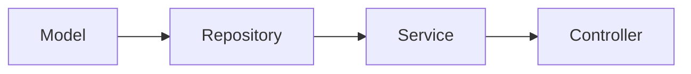

- Table of contents
- [Project Object Model](#pom-project-object-model)
- [Select JRE version](#select-jre-version)
- [Maven Installation](#maven-installation-for-apt-package-manager)
- [Server run command for linux](#server-run-command-for-linux)
- [JDBC](#jdbc)
- [Hibernate](#hibernate)
- [JSP set up in VS Code](#jsp)
- [step by step development flow spring-boot](#step-by-step-development-flow-in-spring-boot)
>> sudo lsof -i :8000 && kill -9 PID
 
### Keywords-

- POJO -> Plain Old Java Object
- AOP -> Aspect Oriented Programming
- POM -> Project Obejct Model
- IoC -> Inversion of Control  
- DI -> Dependency Injection
- JSP -> Java Server Pages

### POM (Project Object Model)


### Select JRE version:

```bash
sudo apt install openjdk-17-jdk -y
sudo update-alternatives --config java
```

### Maven installation for apt package manager

```bash
sudo apt install maven
```

### Server run command for linux

```bash
mvn clean && mvn package && mvn spring-boot:run
```

### For multiple instances by port changing

```bash
mvn spring-boot:run -Dspring-boot.run.arguments="--server.port=8081"
```

### API's:
- 1. localhost:8000/hello

### Layers of Spring Boot

## 1️⃣ Presentation Layer (Controller Layer)

* **কি কাজ করে:**
  ইউজারের request handle করে এবং response return করে।
* **কোনো UI framework** বা REST API এখানে বসে।
* **Key Components:**

  * `@Controller` (web pages জন্য)
  * `@RestController` (REST API জন্য)
  * `@RequestMapping`, `@GetMapping`, `@PostMapping` ইত্যাদি

**Example:**

```java
@RestController
@RequestMapping("/users")
public class UserController {
    @GetMapping
    public List<User> getAllUsers() { ... }
}
```

---

## 2️⃣ Service Layer (Business Logic Layer)

* **কি কাজ করে:**
  সমস্ত business logic handle করে। Controller শুধু service কে call করে।
* **Key Components:**

  * `@Service`
  * `@Transactional`

**Example:**

```java
@Service
public class UserService {
    public List<User> getAllUsers() { ... }
}
```

---

## 3️⃣ Data Access Layer (Repository Layer)

* **কি কাজ করে:** Database operations handle করে।
* **Key Components:**

  * `@Repository`
  * Spring Data JPA interfaces: `JpaRepository`, `CrudRepository`

**Example:**

```java
@Repository
public interface UserRepository extends JpaRepository<User, Long> { }
```

---

## 4️⃣ Model Layer (Entity Layer)

* **কি কাজ করে:** Database table represent করে।
* **Key Components:**

  * `@Entity`
  * `@Table`, `@Id`, `@GeneratedValue`

**Example:**

```java
@Entity
public class User {
    @Id @GeneratedValue
    private Long id;
    private String name;
}
```

---

## 5️⃣ Configuration Layer

* **কি কাজ করে:** Spring Boot app setup ও configuration handle করে।
* **Key Components:**

  * `@Configuration`
  * `@Bean`
  * `application.properties` / `application.yml`

**Example:**

```java
@Configuration
public class AppConfig {
    @Bean
    public PasswordEncoder passwordEncoder() {
        return new BCryptPasswordEncoder();
    }
}
```

---

## 6️⃣ Optional Layers

### a) Security Layer

* `Spring Security` দিয়ে authentication & authorization handle করা হয়।
* `@EnableWebSecurity` + `WebSecurityConfigurerAdapter` ব্যবহার হয়।

### b) Exception / Advice Layer

* Global exception handling, response standardization।
* `@ControllerAdvice` + `@ExceptionHandler` ব্যবহার হয়।

---

### 🌐 Layer Diagram (Simple)

```
Client (Browser/Postman)
        |
        v
Presentation Layer (Controller)
        |
        v
Service Layer (Business Logic)
        |
        v
Repository Layer (Database Access)
        |
        v
Database (MySQL/PostgreSQL/H2)
```

---

💡 **Tip:**

* এই layered architecture Django এর **views → models → templates** এর মতো।
* Spring Boot-এ আরও modular এবং Java ecosystem friendly, plus REST API, Microservices সহজে integrate করা যায়।


### JDBC
### Hibernate
- Installation postgres using podman

```bash
podman run -it --name Postgress -e POSTGRES_PASSWORD=password -e POSTGRES_USER=user -p 5432:5432 postgres 
```
`Then Press CTRL+C`

```bash
podman start Postgres
podman exec -it Postgres bash
```

```bash
psql -U user
```

```sql
create database "Hibernate";
```

```sql
\l # db list
```

```sql
\c dbName # Switch between multiple db
```
```sql
\dt # show table 
SELECT table_name
FROM information_schema.tables
WHERE table_schema = 'public';
```

`Hibernate hibernate.cfg.xml`

```xml
<hibernate-configuration>
    <session-factory>
        <!-- JDBC Connection Settings -->
        <property name="hibernate.connection.driver_class">org.postgresql.Driver</property>
        <property name="hibernate.connection.url">jdbc:postgresql://localhost:5432/Practice_Hibernate_1</property>
        <property name="hibernate.connection.username">user</property>
        <property name="hibernate.connection.password">password</property>
        <property name="hibernate.hbm2ddl.auto">update</property>
        <property name="hibernate.dialect">org.hibernate.dialect.PostgreSQLDialect</property>
        <property name="hibernate.show_sql">true</property>
        <property name="hibernate.format_sql">true</property>
    </session-factory>
</hibernate-configuration>

```


### Established connection

```java
import org.hibernate.Session;
import org.hibernate.SessionFactory;
import org.hibernate.Transaction;
import org.hibernate.cfg.Configuration;
try {
        Student std1 = new Student();
        std1.setRoll(4);
        std1.setName("User Four");
        std1.setAge(23);
        Laptop laptop1=new Laptop();
        laptop1.setBrand("Lenovo");
        laptop1.setModel("LOQ 13");
        laptop1.setRam(16);
        laptop1.setId(01);
        std1.setLaptop(laptop1);
        Configuration configuration = new Configuration().addAnnotatedClass(Student.class).addAnnotatedClass(Laptop.class).configure();
        SessionFactory sessionFactory = configuration.buildSessionFactory();
        Session session = sessionFactory.openSession();
        Transaction transaction = session.beginTransaction(); /*Because hibernate follows ACID (Atomicity, Consistency, Isolation, Durability) properties.*/
        session.persist(std1); /* create */
        session.persist(laptop1);
        // session.merge(std1); /*update */
        Student std2=session.get(Student.class,2); /*read */
        // session.remove(std2); /* delete */
        transaction.commit();
        
        System.out.println(std2);
        session.close();

        sessionFactory.close();
        } catch (Exception e) {
            System.out.println(e.getMessage());
        }
```

`CRUD`

```java
session.persist(std1); /* create */
session.merge(std1); /*update */
Student std2=session.get(Student.class,2); /*read */
session.remove(std2); /* delete */
```

## Different Between fetch=FetchType.EAGER vs LAZY
| Feature | `@ManyToMany(fetch = FetchType.EAGER)` | `@ManyToMany(fetch = FetchType.LAZY)` |
| :--- | :--- | :--- |
| **When Data Loads** | **Immediately** with the parent entity. | **On-demand** (only when the getter method is called). |
| **Database Queries** | Usually **one or more JOINs** in a single database round trip. | A **separate SELECT** query runs for the related data upon access. |
| **Performance Impact** | Good for small collections. **Poor performance** for large collections (risk of memory bloat). | **Memory efficient**. Risk of **N+1 queries** or `LazyInitializationException`. |
| **Session Dependency** | **No** dependency. Data is available even if the session is closed. | **Requires an active session** when accessing the data. Session closure before access causes an exception. |
| **Best Practice** | Use only for relationships you **must** have available immediately. | **Recommended default** for collections. Use `JOIN FETCH` or Entity Graphs to selectively eager-load when required. |


## HQL:

```java
Query query=session.createQuery("from Laptop where id=1",Laptop.class);
List<Laptop> result=query.getResultList();
System.out.println(result);
```

```java
String cpu="Ryzen 5 5625U";
        Query query=session.createQuery("from Laptop where cpu like ?1",Laptop.class); 
        query.setParameter(1, cpu);
        List<Laptop> result=query.getResultList();
        System.out.println(result);
/*The code performs the following actions:

1. Sets a parameter: Defines the CPU value to search for as "Ryzen 5 5625U".

2. Creates a Typed Query: Initializes a generic Query<Laptop> object using the HQL from Laptop where cpu like ?1 and specifies Laptop.class to ensure the results are correctly typed.

3. Binds the Parameter: Replaces the positional placeholder ?1 with the Java variable cpu's value, which is essential for security (SQL Injection prevention).

4. Executes and Retrieves: Executes the query using getResultList() and converts the matching database records into a List<Laptop> of Java objects.

5. Prints: Outputs the list of retrieved Laptop objects to the console.*/
```


## IoC Principle and DI: Inversion of Control and Dependency Injection

## JSP

```bash
Create war packaging. -> mvn clean package -> java -jar target\filename.jar
```


# jsp

<a href="https://www.youtube.com/watch?v=G9HUmFd_t6I">Spring Boot With JSP ( JavaServer Pages )</a>

# Step by step development flow in Spring Boot



# Status Code

|Status Code|Description|
|-----------|-----------|
| 100 | Continue |
| 101 | Switching Protocols |
| 102 | Processing |
| 103 | Early Hints |
| 200 | OK |
| 201 | Created |
| 202 | Accepted |
| 203 | Non-Authoritative Information |
| 204 | No Content |
| 205 | Reset Content |
| 206 | Partial Content |
| 207 | Multi-Status |
| 208 | Already Reported |
| 226 | IM Used |
| 300 | Multiple Choices |
| 301 | Moved Permanently |
| 302 | Found |
| 303 | See Other |
| 304 | Not Modified |
| 305 | Use Proxy |
| 307 | Temporary Redirect |
| 308 | Permanent Redirect |
| 400 | Bad Request |
| 401 | Unauthorized |
| 402 | Payment Required |
| 403 | Forbidden |
| 404 | Not Found |
| 405 | Method Not Allowed |
| 406 | Not Acceptable |
| 407 | Proxy Authentication Required |
| 408 | Request Timeout |
| 409 | Conflict |
| 410 | Gone |
| 411 | Length Required |
| 412 | Precondition Failed |
| 413 | Payload Too Large |
| 414 | URI Too Long |
| 415 | Unsupported Media Type |
| 416 | Range Not Satisfiable |
| 417 | Expectation Failed |
| 418 | I'm a teapot |
| 421 | Misdirected Request |
| 422 | Unprocessable Entity |
| 423 | Locked |
| 424 | Failed Dependency |
| 425 | Too Early |
| 426 | Upgrade Required |
| 428 | Precondition Required |
| 429 | Too Many Requests |
| 431 | Request Header Fields Too Large |
| 451 | Unavailable For Legal Reasons |
| 500 | Internal Server Error |
| 501 | Not Implemented |
| 502 | Bad Gateway |
| 503 | Service Unavailable |
| 504 | Gateway Timeout |
| 505 | HTTP Version Not Supported |
| 506 | Variant Also Negotiates |
| 507 | Insufficient Storage |
| 508 | Loop Detected |
| 510 | Not Extended |
| 511 | Network Authentication Required |


# Install protobuf-compiler for gRPC

```bash
sudo apt install protobuf-compiler
``` 


